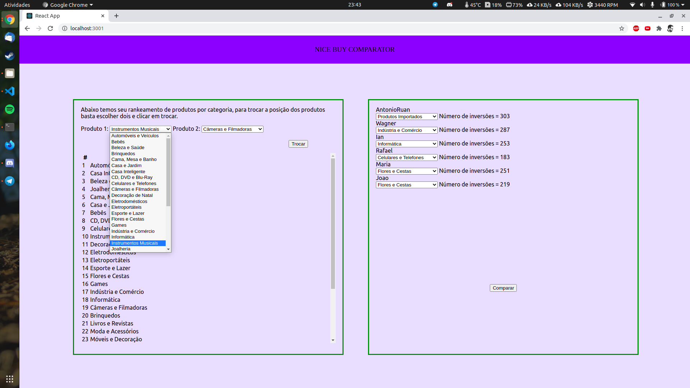

# Nice Buy Comparator

**Número da Lista**: 07<br>
**Conteúdo da Disciplina**: Dividir e Conquistar<br>

## Alunos
|Matrícula | Aluno |
| -- | -- |
| 18/0030272 | Antonio Ruan Moura Barreto |
| 18/0029177 | Wagner Martins da Cunha |

## Sobre 
O NiceBuyComparator compara listas de desejo rankeadas entre usuários, retornando o quão semelhantes são os gostos entre esses usuários. Para esse cálculo foi usado o algoritmo de contagem de inversões.

## Screenshots





## Instalação 
**Linguagem**: Javascript<br>
**Framework**: ReactJs<br>

Requisitos: NodeJs e npm

Primeiro, faça o download dos arquivos na sua máquina com:

```
$ git clone https://github.com/projeto-de-algoritmos/DC_Nice_Buy_Comparator.git
```

Após isso vá para a pasta app, onde se encontram os arquivos para execução do projeto com:

```
$ cd DC_Nice_Buy_Comparator/app
```

Agora é só instalar as dependências com o seguinte comando:

```
$ npm install
```


## Uso 

Para rodar o projeto, após sua instalação, basta realizar este comando:

```
$ npm start
```
